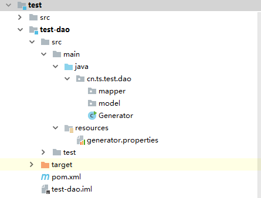
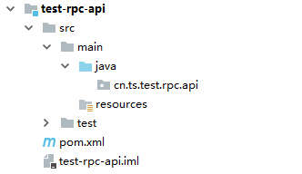
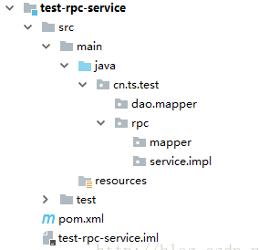
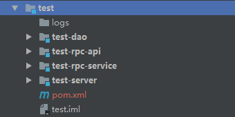

# lambo-common

`lambo`项目SSM框架公共模块

# 如何新建一个工程：

## 1.新建一个maven模块

```xml
    <groupId>cn.ts</groupId>
    <artifactId>test</artifactId>
```

## 2.建立对应的子模块
     
     有一些子模块你是必须要建立的,可以参考lambo-demo建立，主要是为了使用代码生成快速的构建代码，毕竟手动效率相对来说比较低。
     
### test-dao pom 文件
 
```xml
 <?xml version="1.0" encoding="UTF-8"?>
 <project xmlns="http://maven.apache.org/POM/4.0.0"
          xmlns:xsi="http://www.w3.org/2001/XMLSchema-instance"
          xsi:schemaLocation="http://maven.apache.org/POM/4.0.0 http://maven.apache.org/xsd/maven-4.0.0.xsd">
     <parent>
         <artifactId>test</artifactId>
         <groupId>cn.ts</groupId>
         <version>1.0.0</version>
     </parent>
 
     <modelVersion>4.0.0</modelVersion>
 
     <groupId>cn.ts</groupId>
     <artifactId>test-dao</artifactId>
     <version>1.0.0</version>
 
     <name>test-dao</name>
 
     <dependencies>
         <dependency>
             <groupId>com.lambo</groupId>
             <artifactId>lambo-common</artifactId>
             <version>1.0.0</version>
             <type>jar</type>
         </dependency>
     </dependencies>
 
     <build>
         <finalName>test-dao</finalName>
         <resources>
             <resource>
                 <directory>src/main/java</directory>
                 <includes>
                     <include>**/*.xml</include>
                 </includes>
                 <filtering>true</filtering>
             </resource>
             <resource>
                 <directory>src/main/resources</directory>
                 <excludes>
                     <exclude>generatorConfig.xml</exclude>
                 </excludes>
             </resource>
         </resources>
         <plugins>
             <plugin>
                 <groupId>org.mybatis.generator</groupId>
                 <artifactId>mybatis-generator-maven-plugin</artifactId>
                 <version>1.3.2</version>
                 <dependencies>
                     <dependency>
                         <groupId>com.zheng</groupId>
                         <artifactId>zheng-common</artifactId>
                         <version>1.0.0</version>
                     </dependency>
                 </dependencies>
                 <configuration>
                     <verbose>true</verbose>
                     <overwrite>true</overwrite>
                 </configuration>
             </plugin>
             <plugin>
                 <groupId>org.apache.maven.plugins</groupId>
                 <artifactId>maven-surefire-plugin</artifactId>
                 <version>2.18.1</version>
                 <configuration>
                     <skipTests>true</skipTests>
                     <testFailureIgnore>true</testFailureIgnore>
                 </configuration>
             </plugin>
         </plugins>
     </build>
 </project>
```

### test-rpc-api pom
 
```xml
 <?xml version="1.0" encoding="UTF-8"?>
 <project xmlns="http://maven.apache.org/POM/4.0.0"
          xmlns:xsi="http://www.w3.org/2001/XMLSchema-instance"
          xsi:schemaLocation="http://maven.apache.org/POM/4.0.0 http://maven.apache.org/xsd/maven-4.0.0.xsd">
     <parent>
         <artifactId>test</artifactId>
         <groupId>cn.ts</groupId>
         <version>1.0.0</version>
     </parent>
     <modelVersion>4.0.0</modelVersion>
 
     <groupId>cn.ts</groupId>
     <artifactId>test-rpc-api</artifactId>
     <version>1.0.0</version>
 
 
 </project>
```
 
### test-rpc-service pom
 
```xml
 <?xml version="1.0" encoding="UTF-8"?>
 <project xmlns="http://maven.apache.org/POM/4.0.0"
          xmlns:xsi="http://www.w3.org/2001/XMLSchema-instance"
          xsi:schemaLocation="http://maven.apache.org/POM/4.0.0 http://maven.apache.org/xsd/maven-4.0.0.xsd">
     <parent>
         <artifactId>test</artifactId>
         <groupId>cn.ts</groupId>
         <version>1.0.0</version>
     </parent>
     <modelVersion>4.0.0</modelVersion>
 
     <groupId>cn.ts</groupId>
     <artifactId>test-rpc-service</artifactId>
     <version>1.0.0</version>
 
 
 </project>
```
 
## 3.添加相关的package
 
 三层的package都最好自己添加，不然在自动生成代码的时候可能会爆出缺少文件路径的问题
 
### test-dao 
⑴.添加cn.ts.dao包，再继续在这个下面添加mapper和mdoel的package


     
⑵.复制粘贴别的模块的Generator.java和generator.properties
    Generator.java代码：
```java
    // 根据命名规范，只修改此常量值即可
    /**
     * 根据模板生成generatorConfig.xml文件
     * @param jdbc_driver   驱动路径
     * @param jdbc_url      链接
     * @param jdbc_username 帐号
     * @param jdbc_password 密码
     * @param module        项目模块
     * @param database      数据库
     * @param table_prefix  表前缀
     * @param package_name  包名
     */
    private static String MODULE = "test";  //这个地方千万注意源代码里面写的什么东西，有个小点的东西不需要
    private static String DATABASE = "lambo";
    private static String TABLE_PREFIX = "t_"; //我新建的表名没有去用模块的名字作为前缀
    private static String PACKAGE_NAME = "cn.ts.test";
    private static String JDBC_DRIVER = PropertiesFileUtil.getInstance("generator").get("generator.jdbc.driver");
    private static String JDBC_URL = PropertiesFileUtil.getInstance("generator").get("generator.jdbc.url");
    private static String JDBC_USERNAME = PropertiesFileUtil.getInstance("generator").get("generator.jdbc.username");
    private static String JDBC_PASSWORD = PropertiesFileUtil.getInstance("generator").get("generator.jdbc.password");
    // 需要insert后返回主键的表配置，key:表名,value:主键名
    private static Map<String, String> LAST_INSERT_ID_TABLES = new HashMap<>();
    static {
        //LAST_INSERT_ID_TABLES.put("upms_user", "user_id");//不需要的我就直接注释了
    }

    /**
     * 自动代码生成
     * @param args
     */
    public static void main(String[] args) throws Exception {
        MybatisGeneratorUtil.generator(JDBC_DRIVER, JDBC_URL, JDBC_USERNAME, JDBC_PASSWORD, MODULE, DATABASE, TABLE_PREFIX, PACKAGE_NAME, LAST_INSERT_ID_TABLES);
    }
```

generator.properties配置：
```xml
    generator.jdbc.driver=com.mysql.jdbc.Driver
    generator.jdbc.url=jdbc\:mysql\://dbserver\:3306/lambo?useUnicode\=true&characterEncoding\=utf-8&autoReconnect\=true
    generator.jdbc.username=root
    generator.jdbc.password=2eTCS06SBfrVKFGZuvEjTA==
```
     
⑶.java文件缺少的包，自己在dao的pom文件里面添加下面的依赖就ok了
     
```xml
     <dependency>
         <groupId>com.lambo</groupId>
         <artifactId>lambo-common</artifactId>
         <version>1.0.0</version>
         <type>jar</type>
     </dependency>
```
  
### test-rpc-api 
    添加cn.ts.test.api的package
     

     
### test-rpc-service
```xml
     cn.ts.test.dao.mapper
     cn.ts.test.rpc.mapper
     cn.ts.test.rpc.service.impl
```

     
## 4.完成以上的操作基本上就可以用代码自动生成进行基础代码的构建
log打印结果如下：
```xml
    ========== 开始生成generatorConfig.xml文件 ==========
    数据库连接成功
    t_company
    t_user
    释放数据库连接
    ========== 结束生成generatorConfig.xml文件 ==========
    ========== 开始运行MybatisGenerator ==========
    log4j:WARN No appenders could be found for logger (org.mybatis.generator.internal.db.DatabaseIntrospector).
    log4j:WARN Please initialize the log4j system properly.
    ========== 结束运行MybatisGenerator ==========
    ========== 开始生成Service ==========
    D:/workspace/lambo/test/test-rpc-api/src/main/java/cn/ts/test/rpc/api/TCompanyService.java
    D:/workspace/lambo/test/test-rpc-api/src/main/java/cn/ts/test/rpc/api/TCompanyServiceMock.java
    D:/workspace/lambo/test/test-rpc-service/src/main/java/cn/ts/test/rpc/service/impl/TCompanyServiceImpl.java
    D:/workspace/lambo/test/test-rpc-api/src/main/java/cn/ts/test/rpc/api/TProductService.java
    D:/workspace/lambo/test/test-rpc-api/src/main/java/cn/ts/test/rpc/api/TProductServiceMock.java
    D:/workspace/lambo/test/test-rpc-service/src/main/java/cn/ts/test/rpc/service/impl/TProductServiceImpl.java
    ========== 结束生成Service ==========
```

当然，也可以把common的模块先建立起来，再在“test-dao”的模块中引用“test-common”的depedence,”test-common”中去引用“lambo-common”的depedence
    
附（完整项目参考图）：
    

